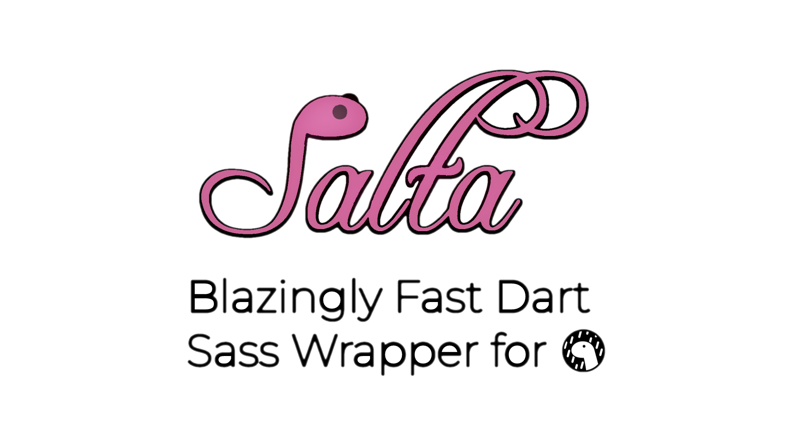

<h1 align="center">
	Salta
</h1>
<p align="center">A Native, Blazingly Fast, and always up-to-date way of using Dart Sass in Deno.</p>
](https://discord.gg/Nhvt7X84Hj)



## Documentation
To get started, import `Salta` and its types from a registry like [deno.land/x](https://deno.land/x/salta) or use it directly from [GitHub](https://raw.githubusercontent.com/lukeed/salta/master/mod.ts).

```ts
import { Salta, Style } from "https://deno.land/x/salta/mod.ts"

const EXAMPLE = Salta.compile({
	file: "/path/to/file.scss",
	style: Style.EXPANDED, // or STYLE.COMPRESSED
	quiet: true
})

console.log(EXAMPLE)
```

Salta under the hood relies on the `sass` (`dart-sass`) binary, which is not provided by most packages managers on Linux or Winget on Windows. You can, however, use `./src/install.ts` to get a copy of said `sass` binary easily, or to update an existing one. It fetches from the official `dart-sass` repository and installs an "isolate" of it under the same folder as Deno.

## License
Salta is licensed under the MIT License. See [LICENSE](./LICENSE) for more information.